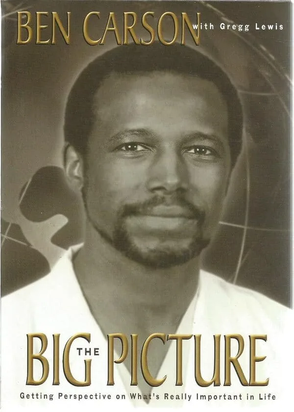

# Week 01 — Success Mindset (Mindset OS)

Part of the DevOps Micro Internship (DMI) Cohort 3 with Agentic AI

---

## Purpose (Read This First)

This week is not motivation homework.

This is you building your **Mindset OS** — the system you will use for the next 5 months (and honestly, for years).

### Expectations

* Be honest.
* Be specific.
* Be practical.
* Write like an adult professional: clear sentences, no one-liners.

You will reuse this in later weeks. So do it properly once.

---

# Assignment 1. What is something you believe to be true that most people around you would disagree with?

### Rules

* No "safe" answers.
* Must be your real belief (not copied from internet).
* Minimum 50 words.

**Hint:** What do you believe about career, money, learning, discipline, relationships, health, success, life, tech industry, etc. that most people don't agree with?

## Answer

Answer: I believe success in life is a function of grace and hardwork, but on the contrary, most people, especially the successful ones, believe it is by hard work. Yes hard work is important but not entirely the determining factor for anyone to succeed in life. So for me God factor is as important as hardwork

---

# Assignment 2. What are the top 3 objective truths you discovered through experimentation and results?

### Definition

Objective truths do not depend on opinions. They hold true regardless of how people feel.

Write each truth in this format:

**Truth:** (1 sentence)

**Evidence from my life:** (2–4 lines: what you tried + what happened)

---

## Truth #1

### Truth

Practice makes perfect. 

### Evidence from my life

I have through practices confirmed that trying anything consistently and regularly will make you master it or become perfect at it. Most skills I am good at right now, came as a result of consistent practices despite starting as a novice

---

## Truth #2

### Truth

Nothing Stops a determined mind

### Evidence from my life

Yes a determined mind will surely succeed irrespective of any challenge. I have confirmed that  once you are determined to achieve anything and you set your mind on it , you will surely excel

---

## Truth #3

### Truth

Failure is actually part of the process of succeeding

### Evidence from my life

Anyone who achieved significant success in life has encountered failure in one way or the other in their lives. I am not an exception to this objective truth as I have failed in many occasions while trying to succeed but I don’t allow failure deter me

---

# Assignment 3. What does your 2.0 version look like?

### Instructions

Write as if a journalist is writing about you **3 to 7 years from now** (not 20 years).

**Minimum 300 words.**

### Rules

* Write in past tense, like it already happened.
* Don't use "likes to / wants to / hopes to."
* Use specifics:

  * built
  * shipped
  * led
  * published
  * earned
  * relocated
  * contributed
* Include skills proof:

  * projects
  * portfolios
  * GitHub
  * blogs
  * certifications
  * job role
  * leadership
  * community contribution
* Add 1–3 images if you can (optional but powerful).

### Publish It Publicly On Any ONE

* LinkedIn
* Medium
* WordPress
* Blogspot
* Personal blog
* Portfolio page

Include this line:

> **P.S. This post is a part of DevOps Micro Internship with Agentic AI Cohort-3 by [Pravin Mishra](https://www.linkedin.com/in/pravin-mishra-aws-trainer/). You can start your DevOps journey by joining this [Discord community](https://discord.pravinmishra.com/) ( https://discord.pravinmishra.com/ ).**

## Your Article

From Broadcast Control Rooms to Cloud Infrastructure: How Felix Emeka Built  Career Across Two Worlds - Reflecting on his 7 years as a DevOps engineer

When colleagues first met Felix Emeka, many knew him as the engineer who kept radio stations on the air. Today, they know him as the engineer who keeps cloud platforms online.
His career has become an example of how technical professionals can successfully reinvent themselves without abandoning their foundations. Rather than viewing broadcasting and cloud computing as separate disciplines, Felix combined the operational discipline of broadcast engineering with modern DevOps practices to build resilient, automated, and scalable systems.

His transition did not happen overnight. Several years earlier, Felix immersed himself in DevOps engineering, learning Linux, networking, cloud computing, containerization, infrastructure as code, CI/CD, monitoring, and security. What started as a personal challenge gradually became professional expertise.He spent countless hours building projects, troubleshooting failures, and documenting solutions until automation became second nature.

Today,his portfolio reflects that journey. He has designed highly available cloud infrastructures across AWS, Azure, automated deployments using Terraform and Ansible, orchestrated containerized applications with Kubernetes, and built CI/CD pipelines that allow development teams to release software quickly and safely. 

Yet his impact extends beyond technology.
As a way of giving back to engineering communities, his guides on Linux administration, networking, cloud architecture, and DevOps workflows are used by aspiring engineers preparing for their first cloud roles. Mentorship has become one of the defining aspects of his career. He is also contributing to the growth of Africa's cloud engineering ecosystem by encouraging more engineers to pursue practical, hands-on technical education.

Organizations value him not only because he understands cloud platforms, but because he understands operations. His background enables him to think beyond writing code. He anticipates failure, designs for resilience, and builds systems that continue functioning when unexpected problems occur. 

As cloud computing, automation, artificial intelligence, and platform engineering continue to reshape the technology landscape, Felix Emeka appears well positioned for the next chapter. 

The engineer who once kept radio stations on the air is now helping build the digital infrastructure that keeps businesses running. And for Felix Emeka, it seems the journey is only beginning.

P.S. This is part of DevOps Micro Internship with Agentic AI Cohort-3 by Pravin Mishra. You can start your DevOps journey by joining this Discord community https://lnkd.in/dzC9gZrq
Many thanks to Co-mentors Joy Ukpabi Faith Samson and Lead Co-mentor Anjana Muthunayake for their  support always

My medium blog link https://lnkd.in/e7gD9VTn

### Public Link

Paste your link here:
Medium blog link
https://medium.com/@felixemeka28/from-broadcast-control-rooms-to-cloud-infrastructure-how-felix-emeka-built-career-across-two-09ebc4af885d

Linkedin Post link
https://www.linkedin.com/posts/felix-nwobodo-2a191856_from-broadcast-control-rooms-to-cloud-infrastructure-activity-7478123964666462208-fuNh?utm_source=share&utm_medium=member_desktop&rcm=ACoAAAvh1JkBJ6D4mRJp1t4mfqeNh2YQjVD8ZhE

---

# Assignment 4. Have you ever cut corners (unethical / dishonest / shortcut behavior — not necessarily illegal)? If yes, how did it make you feel?

### Important

You don't need to write the full story.

Focus on the feeling:

* guilt
* fear
* shame
* stress
* regret
* numbness
* etc.

This is about self-awareness, not judgment.

### Answer Format

**Yes / No**

If Yes:

**What emotion did you feel?** (minimum 50–100 words)

## Answer

Yes I have and the emotions  is that of a mixed feelings as it has helped me saved time and reduced stress which is a feeling of happiness but  later on my conscience will start pricking me ,making me  feel a strong sense of guilt, shame, or moral discomfort because I have done something wrong.

---

# Assignment 5. What are 10 non-fiction books you plan to read in the next 1 year?

### Rules

* Mention **Title + Author**
* Any language allowed
* No fiction novels

### Tip

Choose books that improve:

* mindset
* communication
* productivity
* health
* money
* career
* leadership

## Book List

1.Big Picture by Ben Carson and Gregg Lewis 

2.Power of Discipline by Daniel Walter

 

3.You Become What You Think About by  Vic Johnson

4.The Power of Positive Thinking by Norman Vincent Peale

5.Think Big by Ben Carson

6.Ultimate Git and GitHub for Modern Software Development  by  Pravin Mishra

7.Mind Management, Not Time Management By David Kadavy

8.Change your Thinking ,Change your Life by Brian Tracy

9.The Magic of Thinking Big by David J. Schwartz

10.Brain Power by Victor Menderez

# Assignment 6. What are the things you will measure regularly in your life and career?

### Rules

List topics only. No need to share numbers.

### Must Include

* Learning / skill
* Output / proof
* Health / energy
* Time / focus
* Money / finance (personal or business)

### Example

* Learning hours per week
* Deep work sessions per week
* Projects shipped / documented
* Steps / workouts
* Sleep hours
* Spending tracker

## My Metrics

Here are a few things I will measure regularly to stay aligned with my goals:

Going forward I will be mindful of my learning. I will measure my learning progress and skills acquired consequently.

I will measure my output by carrying out tasks and project as a proof of my progress 
I will measure my  Wake-up & sleep time , because health is key

I will measure my learning time and ensure to maintain a consistent and doable learning period.

I will measure my financial spending by ensuring I don’t waste money on what is not necessary

# Assignment 7. Brain Dump + 5-Month System Plan

## Step 1: Brain Dump (Private)

Do a brain dump of everything in your mind into a notebook.

Examples:

* Bills
* Tasks
* Worries
* Goals
* Pending messages
* Ideas
* Responsibilities

### Did You Do It?

**Yes / No**

Answer:

Yes

---

## Step 2: Your 5-Month Routine + Focus Blocks

Create a simple plan you can realistically follow for the next 5 months.

### Weekly Routine

Example:

* Mon–Thu: 60 min deep work
* Sat: DMI session
* Sun: Weekly review

#### My Weekly Routine

Mon-Fri: I have dedicated 2hours every day for my DevOps learning. During this time, I will learn for 1 hour and used the remaining 1 hour to practice. 
Sat:The Saturday DMI live session is a must attend for me. 
Sun:I will use the two hours on Sunday to summarize what I learnt for the week

### Focus Blocks

#### When Will You Do DMI Work? (Days + Time)

I will start from Sunday and work on it till Friday. Atleast 2 hours each day during the day

#### How Many Sessions Per Week?

Atleast 6 session per week

---

### Distraction Rules

Examples:

* Phone rules
* Social media rules
* Environment setup

#### My Distraction Rules
One task at a time
Every task has a timer
No entertainment or pleasure until I completes my planned work

# Reflection – Week 1

### Biggest insight I got about myself this week

This week, I realized that my success depends less on learning new things and more on protecting my focus.
I don't struggle because I lack the ability to understand difficult concepts. I struggle when I allow distractions, unnecessary task switching, or unplanned activities to take time away from my most important work.
I also noticed that when I commit to one task and give it my full attention, I make meaningful progress much faster than I expected.
Going forward, I want to treat my attention as one of my most valuable resources. I'll prioritize deep work, reduce distractions, and measure my days by the progress I make toward my long-term goals rather than by how busy I feel.
This week reminded me that consistent focus, practiced every day, is what will move me closer to the person I want to become.

### My biggest weakness/loop I noticed

One weakness I experienced was my inability to start my assignment in time . This has made me struggle on the last day of submission which is not supposed to be.

### One system I will implement from this week (exact habit + time)

In the coming week starting with a live session on Saturday, I shall start doing my learning immediately after the live session. This will be accompanied by a serious and timely effort towards doing the week 2 assignment .

### LinkedIn Post

Paste your LinkedIn post link here:

<<<<<<< HEAD:week-01-success-mindset/README.md
*https://www.linkedin.com/posts/felix-nwobodo-2a191856_successmindset-devops-cloud-share-7478509611529129986-AZUW/?utm_source=share&utm_medium=member_desktop&rcm=ACoAAAvh1JkBJ6D4mRJp1t4mfqeNh2YQjVD8ZhE*
=======
`Add your URL here`
>>>>>>> upstream/main:week-01-success-mindset/assignment-01-mindset-os.md

## 10. Proof of Work

- LinkedIn Post URL:*(https://www.linkedin.com/posts/felix-nwobodo-2a191856_successmindset-devops-cloud-share-7478509611529129986-AZUW/?utm_source=share&utm_medium=member_desktop&rcm=ACoAAAvh1JkBJ6D4mRJp1t4mfqeNh2YQjVD8ZhE)*  

- Blog / Medium : **https://medium.com/@felixemeka28/from-broadcast-control-rooms-to-cloud-infrastructure-how-felix-emeka-built-career-across-two-09ebc4af885d**  

---

## 📌 About DMI & CloudAdvisory

DevOps Micro Internship (DMI) is a project-based DevOps program run by Pravin Mishra (The CloudAdvisory) focused on real-world execution, systems thinking, and career readiness.

It helps learners build strong DevOps foundations with hands-on experience.

## 📌 Resources

- 🌐 **DMI Official Website:** https://pravinmishra.com/dmi  
- 🎓 **DevOps for Beginners (Udemy):** https://www.udemy.com/course/devops-for-beginners-docker-k8s-cloud-cicd-4-projects/  
- 🎓 **Ultimate Agentic AI DevOps with Clude Code** https://www.udemy.com/course/ultimate-agentic-ai-devops-with-claude-code/?referralCode=448389767BC96284087B
- 🎓 **DevOps with Claude Code: Terraform, EKS, ArgoCD & Helm** https://www.udemy.com/course/devops-with-claude-code-terraform-eks-argocd-helm/?referralCode=1C5B734505D65A010FA3
- ▶️ **YouTube Playlist (DMI Cohort 3):** https://www.youtube.com/playlist?list=PLFeSNDtI4Cho  
- 🔗 **Pravin Mishra (LinkedIn):** https://www.linkedin.com/in/pravin-mishra-aws-trainer/  
- 🏢 **CloudAdvisory (LinkedIn):** https://www.linkedin.com/company/thecloudadvisory/

---

*This submission is part of DevOps Micro Internship (DMI) Cohort 3 — Agentic AI Track*