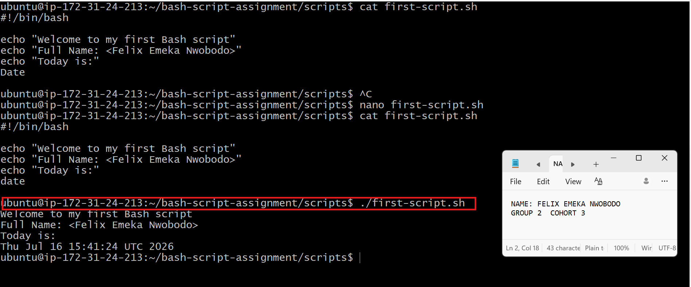
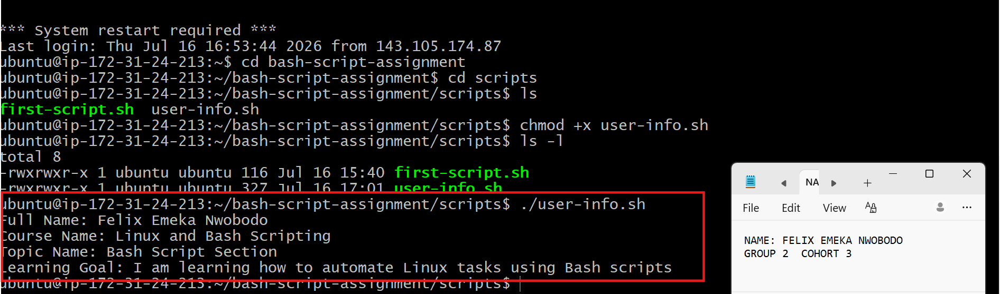
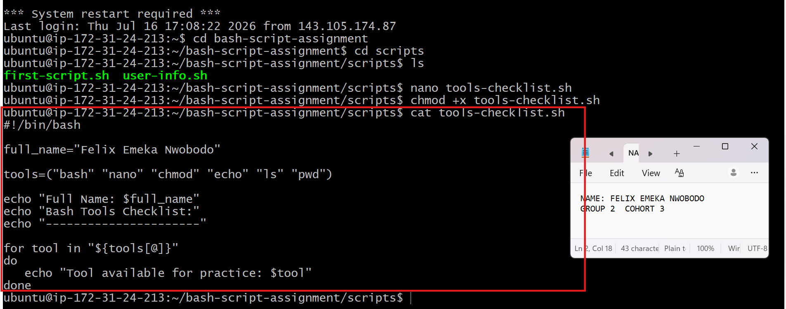
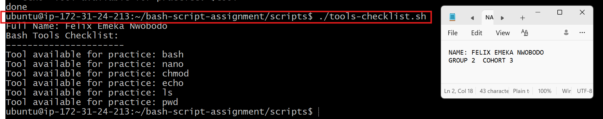
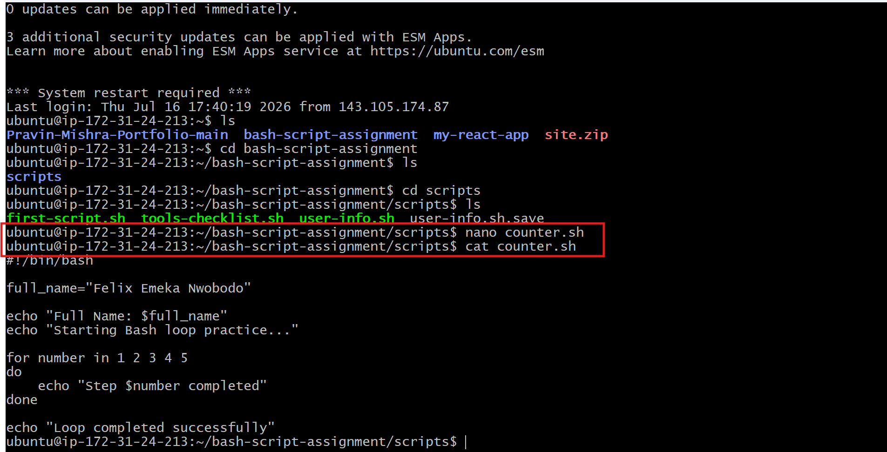
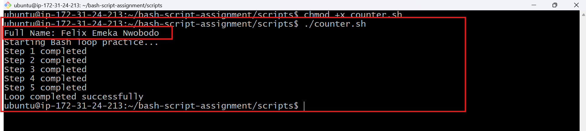
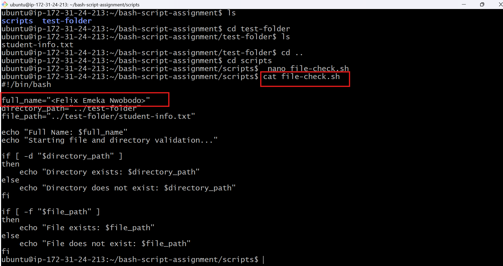
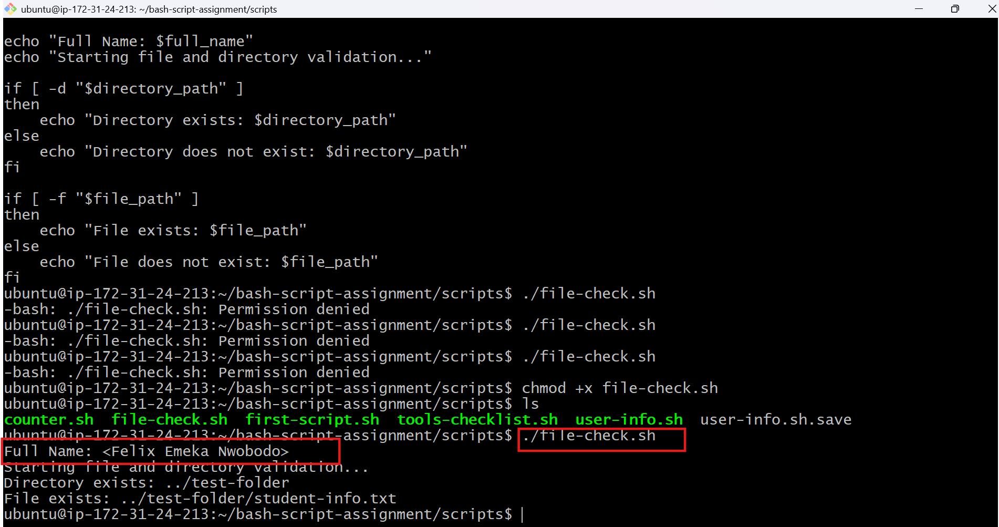
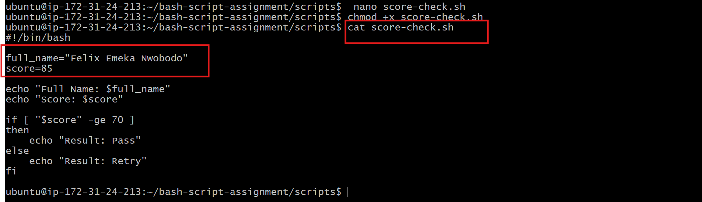
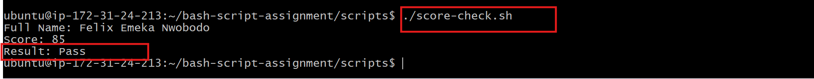

# Assignment 5 — Bash Script Automation Drill (OPS Checklist)

Part of the DevOps Micro Internship (DMI) Cohort 3 with Agentic AI

---

## Purpose

In this assignment, you will practice Bash scripting by building a series of small automation scripts covering environment setup, variables, arrays, loops, file conditionals, if-else logic, and functions. These scripts form the foundation of real-world Linux automation used in DevOps, cloud, and production support environments.

---

# Task 1 — Bash Environment & Workspace Setup

## Goal

Verify that Bash is available on your system and create a clean workspace for this assignment.

### Evidence

#### Screenshot 1 — Output of `echo $SHELL` and `bash --version`

#### Screenshot 2 — Output of `pwd` and `ls -lah` showing the scripts directory

### Notes

Answer the following in your own words:

**1. What is Bash?**

Bash which for 'Bourne Again SHell' , is a command-line interpreter (shell) used primarily on Linux, macOS, and other Unix-like operating systems. It serves as the interface between you and the operating system, allowing you to execute commands, automate tasks, and manage files and processes.It is a scripting language

**2. What is the difference between shell and Bash?**

Shell is the general concept: a program that lets you interact with the operating system using commands.
Bash is one specific shell, some other shells include sh, zsh, ksh, and fish.

**3. Why is it important to confirm the Bash version before writing scripts?**

Confirming the Bash version before writing or running scripts is important because different Bash versions support different features. A script that works perfectly on one system may fail on another if it relies on features that the installed Bash version doesn't support.

# Task 2 — Your First Bash Script

## Goal

Create your first Bash script, make it executable, and run it from the terminal.

### Evidence

#### Screenshot 1 — Content of `first-script.sh`

#### Screenshot 2 — Output of `./first-script.sh`

#### Screenshot 3 — Output of `ls -l first-script.sh` showing executable permission

### Notes

Answer the following in your own words:

**1. What is the purpose of `#!/bin/bash`?**

#!/bin/bash is called the shebang (or hashbang). It tells the operating system which interpreter should be used to execute the script.

**2. Why do we use `chmod +x` before running a script?**

The reason for chmod +x is to make the script executable. Without the execute (x) permission, Linux treats the file as ordinary text and won't allow you to run it directly.

chmod = change mode (change file permissions)
+x = add execute permission

**3. What is the difference between running a script using `./script.sh` and `bash script.sh`?**

./script.sh requires execute (x) permission while
bash script.sh does not require execute permission (only read permission)

# Task 3 — Variables: User Information Script

## Goal

Use variables to store and display user-related information.

### Evidence

#### Screenshot 1 — Content of `user-info.sh`

#### Screenshot 2 — Output of `./user-info.sh`

### Notes

Answer the following in your own words:

**1. What is a variable in Bash?**

A variable in Bash is a named container that stores a value. Instead of hardcoding values in your script, you can store them in variables and reuse them whenever needed.

**2. Why should we avoid spaces around the `=` sign when creating variables?**

We avoid spaces around the = sign because Bash has strict syntax rules for variable assignment.
If we add spaces, Bash may treat the variable name and value as separate commands instead of a variable assignment
When creating a variable, Bash expects the assignment to be written as:
variable=value

**3. How do you access the value stored inside a Bash variable?**

To access the value stored inside a Bash variable, you place a dollar sign ($) before the variable name.

# Task 4 — Arrays & Loops: Tools Checklist Script

## Goal

Use arrays and loops to print a checklist of tools used in Bash scripting.

### Evidence

#### Screenshot 1 — Content of `tools-checklist.sh`

#### Screenshot 2 — Output of `./tools-checklist.sh`

### Notes

Answer the following in your own words:

**1. What is an array in Bash?**

An array in Bash is a variable that can store multiple values under a single name. Instead of creating separate variables for related items, you can keep them together in one array.

**2. Why are arrays useful in scripts?**

Arrays are useful because they let you:
Store multiple related values in one variable.
Loop through a collection of items without repeating code.
Make scripts easier to maintain and update.

**3. What does `"${tools[@]}"` mean?**

"${tools[@]}" is the correct way to refer to all the elements of a Bash array, while keeping each element separate.
The double quotes help keep each array item as a separate value.

**4. What is the purpose of the `for` loop in this script?**

The purpose of the for loop is to repeat a block of commands for each item in a list or array. Instead of writing the same command multiple times, the loop automatically processes each element one by one.

# Task 5 — Loops: Number Counter Script

## Goal

Use loops to repeat a task multiple times.

### Evidence

#### Screenshot 1 — Content of `counter.sh`

#### Screenshot 2 — Output of `./counter.sh`

### Notes

Answer the following in your own words:

**1. What is a loop?**

A loop is a programming construct that repeats a block of code multiple times, either for a fixed number of iterations or until a specified condition is met.

Instead of writing the same commands repeatedly, you write them once inside a loop, and the computer executes them as many times as needed.

**2. Why do we use loops in Bash scripting?**

We use loops in Bash scripting to automate repetitive tasks. Instead of writing the same command multiple times, a loop executes it repeatedly for different values or until a condition is met.

**3. How many times did the loop run in your script?**

The loop ran five times because we gave it five values:

**4. What would you change if you wanted the loop to run 10 times?**

I would add the numbers 6 to 10 to the for loop:
for number in 1 2 3 4 5 6 7 8 9 10
do
Hence my script will be
  
#!/bin/bash

full_name="Felix Emeka Nwobodo"

echo "Full Name: $full_name"
echo "Starting Bash loop practice..."

for number in 1 2 3 4 5 6 7 8 9 10
do
    echo "Step $number completed"
done

# Task 6 — Files & Conditionals: File Validation Script

## Goal

Use file checks and conditionals to verify whether files and directories exist.

### Evidence

#### Screenshot 1 — Output of `ls -lah ../test-folder`

#### Screenshot 2 — Content of `file-check.sh`

#### Screenshot 3 — Output of `./file-check.sh`

### Notes

Answer the following in your own words:

**1. What does `-d` check in Bash?**

In Bash, -d is a file test operator that checks whether a given path exists and if it is a directory.

**2. What does `-f` check in Bash?**

In Bash, -f is a file test operator that checks whether a given path exists and is a regular file.

**3. Why should file and directory paths be stored in variables?**

Storing file and directory paths in variables makes Bash scripts easier to read, maintain, and reuse. Instead of repeating the same path throughout your script, you define it once and reference the variable whenever you need it

**4. What happens if the file does not exist?**

If the file does not exist, the -f check becomes false. Therefore, the commands under else will run, and the following message will be displayed:
File does not exist

# Task 7 — Conditionals: Pass or Retry Script

## Goal

Use if-else conditionals to make decisions based on a variable value.

### Evidence

#### Screenshot 1 — Content of `score-check.sh` with `score=85`

#### Screenshot 2 — Output showing `Result: Pass`

#### Screenshot 3 — Content of `score-check.sh` with `score=55`

#### Screenshot 4 — Output showing `Result: Retry`

### Notes

Answer the following in your own words:

**1. What is the purpose of if-else in Bash?**

The if-else statement in Bash is used to make decisions in a script. It allows the script to execute one block of commands if a condition is true, and a different block if the condition is false.

**2. What does `-ge` mean?**

In Bash, -ge is a numeric comparison operator that means greater than or equal to. It is used to compare two integer values.

**3. Why should conditions be tested with different values?**

We should test conditions with different values to make sure our Bash script behaves correctly in all possible scenarios, not just one.
Here, we use 85 to test the Pass result and 55 to test the Retry result.

**4. How can conditionals help in automation scripts?**

Conditionals help in automation scripts by allowing the script to make decisions based on conditions. Instead of always performing the same actions, the script can respond differently depending on the current situation.
 For example, a script can check whether a service is running, a file exists, or a disk is almost full, and then take the correct action based on the result

# Task 8 — Functions: Final Bash Automation Script

## Goal

Create a final Bash script using functions to organize reusable code.

### Evidence

#### Screenshot 1 — Content of `final-automation.sh`

#### Screenshot 2 — Output of `./final-automation.sh`

#### Screenshot 3 — Output of `ls -lah` showing all created scripts

### Notes

Answer the following in your own words:

**1. What is a function in Bash?**

A function in Bash is a named block of commands that performs a specific task. Instead of writing the same code multiple times, you define it once as a function and call it whenever you need it.

**2. Why are functions useful in scripts?**

Functions are useful in Bash scripts because they let you group related commands into a reusable block of code. Instead of writing the same commands multiple times, you write them once in a function and call the function whenever needed.

**3. Which functions did you create in this script?**

I created four functions:
print_header() prints the assignment header.
print_user_details() prints my full name and the assignment name.
check_files() checks whether the required directory and file exist.
print_tools() uses a loop to print each tool stored in the array.

**4. How does this final script combine variables, arrays, loops, conditionals, files, and functions?**

The script uses variables to store my name, the assignment name, and the required paths. It uses an array to store the tool names and a loop to print them one by one.
It uses if-else conditionals with -d and -f to check if the required directory and file exists.
 Finally, the related commands are organized into functions, and those functions are called in the correct order to run the complete automation script.

# LinkedIn Post (Required)

## Evidence

#### LinkedIn Post URL

Paste your LinkedIn post URL here:

<<<<<<< HEAD:week-03-linux-for-devops/assignment-05-bash-script-automation-drill-ops-checklist.md
https://www.linkedin.com/posts/felix-nwobodo-2a191856_devops-linux-bash-ugcPost-7483915409818218497-4eA-/?utm_source=share&utm_medium=member_desktop&rcm=ACoAAAvh1JkBJ6D4mRJp1t4mfqeNh2YQjVD8ZhE
=======
`Add your URL here`

---
>>>>>>> upstream/main:week-03-linux-and-bash-for-devops/assignment-05-bash-script-automation-drill-ops-checklist.md

#### Screenshot — Published LinkedIn post

# Submission Instructions

- Add all required screenshots in your submission
- Full name must be visible in required screenshots
- All script files must be created and run successfully
- Required notes must be answered clearly for every task
- Do not expose sensitive information (keys, passwords, credentials)

---

# Completion Checklist

- [ ] Task 1: Environment setup verified, workspace created (Screenshots 1–2, Notes answered)
- [ ] Task 2: First script created, executed, permissions verified (Screenshots 1–3, Notes answered)
- [ ] Task 3: Variables script created and run (Screenshots 1–2, Notes answered)
- [ ] Task 4: Arrays and loops script created and run (Screenshots 1–2, Notes answered)
- [ ] Task 5: Counter loop script created and run (Screenshots 1–2, Notes answered)
- [ ] Task 6: File validation script created and run (Screenshots 1–3, Notes answered)
- [ ] Task 7: Pass/Retry conditional script tested with both values (Screenshots 1–4, Notes answered)
- [ ] Task 8: Final automation script created and run (Screenshots 1–3, Notes answered)
- [ ] All scripts run without errors
- [ ] Full Name visible in all required screenshots
- [ ] LinkedIn post published and URL submitted
- [ ] No sensitive data exposed

---

## 📌 About DMI & CloudAdvisory

DevOps Micro Internship (DMI) is a project-based DevOps program run by Pravin Mishra (The CloudAdvisory) focused on real-world execution, systems thinking, and career readiness.

It helps learners build strong DevOps foundations with hands-on experience.

---

## 📌 Resources

- 🌐 DMI Official Website: https://pravinmishra.com/dmi  
- 🎓 DevOps for Beginners (Udemy): https://www.udemy.com/course/devops-for-beginners-docker-k8s-cloud-cicd-4-projects/  
- 🎓 Agentic AI DevOps with Claude Code: https://www.udemy.com/course/ultimate-agentic-ai-devops-with-claude-code/  
- 🎓 DevOps with Claude Code: Terraform, EKS, ArgoCD & Helm: https://www.udemy.com/course/devops-with-claude-code-terraform-eks-argocd-helm/  
- ▶️ YouTube Playlist: https://www.youtube.com/playlist?list=PLFeSNDtI4Cho  
- 🔗 Pravin Mishra (LinkedIn): https://www.linkedin.com/in/pravin-mishra-aws-trainer/  
- 🏢 CloudAdvisory (LinkedIn): https://www.linkedin.com/company/thecloudadvisory/

---

*This submission is part of DevOps Micro Internship (DMI) Cohort 3 — Agentic AI Track.*